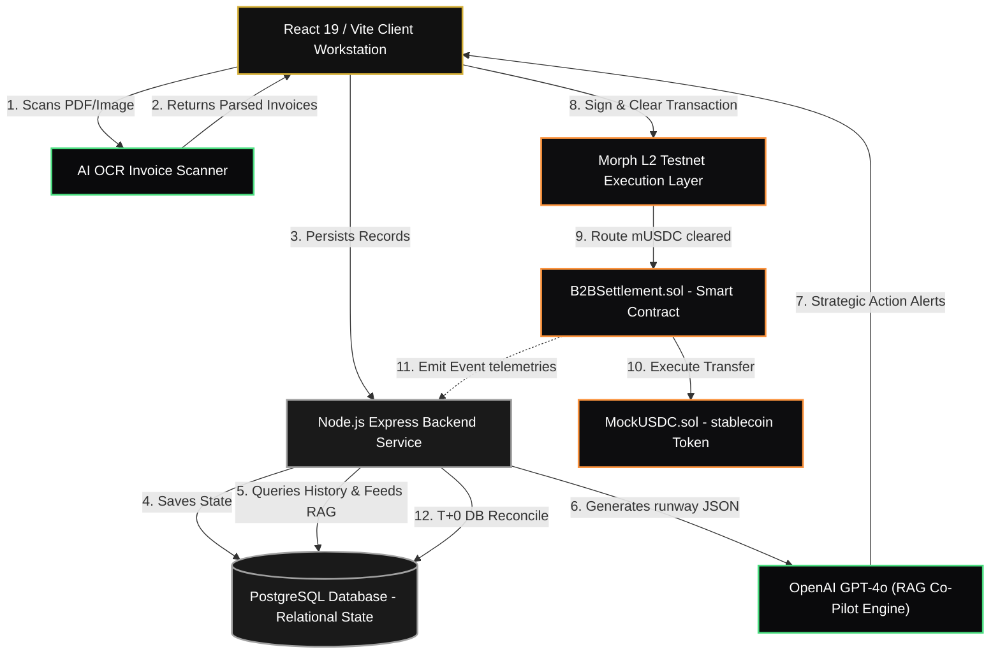
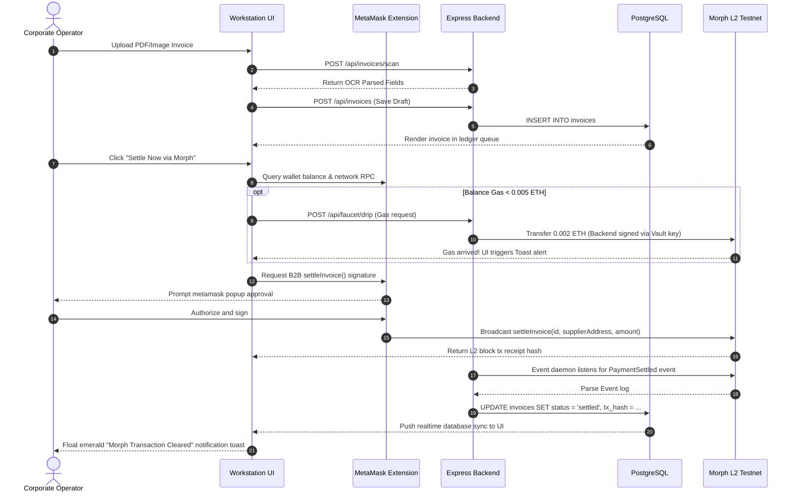

# Fehuvia: Open Finance Web3 B2B SME Treasury Workstation
### Premium System Architecture & Developer Documentation

---

## 🚀 Executive Pitch & Portfolio Summary

**Fehuvia** is a high-fidelity Web3 B2B treasury workstation engineered to solve the silent killer of Southeast Asian SMEs: **liquidity dryouts and multi-day corporate settlement delays**. By merging traditional relational database state tracking with next-generation smart contract execution rails on **Morph Layer 2**, Fehuvia reduces settlement times from a 3-day standard to under **2 seconds (T+0)** while optimizing transaction costs to a fraction of a cent.

Stacked with an **AI Financial Co-Pilot (GPT-4o via context-aware RAG)** and **Automated AI OCR Invoice Digitization**, the platform converts passive, backward-looking books into active, forward-looking treasury defense lines.

```
┌────────────────────────────────────────────────────────────────────────┐
│                              FEHUVIA CORE                              │
│  Traditional Postgres State ── [Real-time Sync] ── Morph L2 EVM State  │
├───────────────────────────────────────────────────────┬────────────────┤
│                     AI CO-PILOT                       │   SETTLEMENT   │
│   RAG Cashflow Forecasts & OCR Automated Ingesting    │  T+0 Cleared   │
└───────────────────────────────────────────────────────┴────────────────┘
```

---

## 🏗️ Core Architectural Modules

Fehuvia coordinates five modular core architectures designed to unify traditional banking concepts with secure Web3 settlement rails:



### 1. Real-time EVM-to-DB Synchronization (The Listener Daemon)
* **Design Philosophy:** Rather than relying on fragile polling or client-side write assumptions, Fehuvia operates a reliable off-chain **Listener Daemon** (`listener.js`) connected to the Morph L2 node via JSON-RPC.
* **Mechanism:** The daemon listens directly to EVM log streams. When the `B2BSettlement` contract emits a `PaymentSettled` event, the backend validates it cryptographically, updates the invoice state in PostgreSQL, and logs symmetrical records for buyers and sellers instantly.

### 2. Off-Chain AI RAG Runway Forecast (GPT-4o Engine)
* **RAG Prompt Assembly:** The Express backend retrieves a merchant's entire 30-day cashflow logs, unpaid obligations, and pending receipts from PostgreSQL.
* **Structured Intelligence:** Rather than generic chatbots, it feeds this rich ledger context to GPT-4o through highly structured system prompts, returning actionable JSON outputs.
* **Actionable Ratings:** Classifies pending invoices into three distinct statuses:
  * 🟢 `Safe to Pay`: Cash reserves are projected to remain robust (>45 days runway) post-settlement.
  * 🔴 `Delay`: Postpone payment due to impending liquidity stress (e.g. payroll mismatch).
  * 🟡 `Review`: Manual audit advised (potential duplication, price deviations, or unlinked supplier details).

### 3. Automated OCR Invoice Scanning
* **Grid OCR Parsing:** Uploaded PDF and image invoices are fed into an intelligent character parsing model that automatically extracts supplier names, due dates, billing details, and total amounts.
* **Smart Autocomplete:** Instantly populates the frontend billing drawer, mapping parsed suppliers to existing registered partners in the directory.

### 4. Background Gas Faucet (Automated Gas Dispenser)
* **The UX Solution:** The primary friction point for traditional corporate operators transitioning to Web3 is gas management (acquiring ETH for transaction fees).
* **Self-Healing Gas Pipeline:** The workstation monitors the connected MetaMask address. If the account gas drops below `0.005 ETH`, Fehuvia invokes an automated background faucet (`/api/faucet/drip`). The backend signs a transaction using a funded **Vault Private Key** and dispenses `0.002 ETH` asynchronously to the user's wallet.

---

## 🛠️ The Professional Technology Stack

| Architecture Layer | Technology Framework | Role & Integration | Rationale |
| :--- | :--- | :--- | :--- |
| **Presentation (UI)** | **React 19 / Vite** | Client interface, custom glassmorphism styling, responsive financial charts. | Fast page rendering, zero bundle bloat, optimized tree-shaking. |
| **Backend API** | **Node.js + Express** | Orchestrates REST API end-points, OCR Scanning engine, Gas drip faucet dispenser. | Fast event loops, excellent support for asynchronous Web3 library modules. |
| **Smart Contracts** | **Solidity ^0.8.24** | Immutable settlement and ERC-20 token standard operations on Morph L2. | Industry-standard security compiling on a sub-second finality Layer 2. |
| **Local Blockchain** | **Hardhat** | Custom compile scripts, node simulations, and smart contract testing. | Fast local verification and migration workflows before testnet push. |
| **Data Persistence** | **PostgreSQL** | Relational data tracking for suppliers, users, and detailed transaction ledger logs. | High-performance sub-queries, ACID compliance, and robust transaction isolation. |
| **Wallet Protocol** | **EIP-1193 Standard** | Client browser MetaMask injection via `window.ethereum`. | Seamless transaction signing, secure key handling, zero server custody. |

---

## ⛓️ Smart Contract Implementation Details

Fehuvia's decentralized settlement protocol comprises two main smart contracts deployed on the **Morph L2 Testnet**:

### 1. `B2BSettlement.sol`
Enforces atomic stablecoin transfers, records invoice-specific clearance status on-chain, and provides the event log telemetry that anchors the system's dual-state synchronization.

* **Checks-Effects-Interactions Pattern:** Prevents reentrancy vectors by marking the invoice as settled (`settledInvoices[invoiceId] = true`) *prior* to interacting with the external stablecoin ERC-20 contract.

```solidity
// SPDX-License-Identifier: MIT
pragma solidity ^0.8.24;

import "@openzeppelin/contracts/token/ERC20/IERC20.sol";

contract B2BSettlement {
    IERC20 public immutable stablecoin;
    mapping(string => bool) public settledInvoices;

    event PaymentSettled(
        string indexed invoiceId,
        address indexed buyer,
        address indexed supplier,
        uint256 amount,
        uint256 timestamp
    );

    constructor(address _stablecoinAddress) {
        require(_stablecoinAddress != address(0), "Invalid stablecoin address");
        stablecoin = IERC20(_stablecoinAddress);
    }

    function settleInvoice(
        string calldata invoiceId,
        address supplier,
        uint256 amount
    ) external {
        require(bytes(invoiceId).length > 0, "Invoice ID cannot be empty");
        require(supplier != address(0), "Invalid supplier address");
        require(amount > 0, "Amount must be greater than zero");
        require(!settledInvoices[invoiceId], "Invoice already settled");

        // Effects: Enforce prevention of double-clearance exploits
        settledInvoices[invoiceId] = true;

        // Interactions: Secure atomic stablecoin routing
        bool success = stablecoin.transferFrom(msg.sender, supplier, amount);
        require(success, "Stablecoin transfer failed");

        emit PaymentSettled(invoiceId, msg.sender, supplier, amount, block.timestamp);
    }
}
```

### 2. `MockUSDC.sol`
A mock ERC-20 token mimicking standard USDC operations, scaled to **6 decimal precision**, incorporating a testing mint faucet.

```solidity
// SPDX-License-Identifier: MIT
pragma solidity ^0.8.24;

import "@openzeppelin/contracts/token/ERC20/ERC20.sol";

contract MockUSDC is ERC20 {
    uint8 private constant _customDecimals = 6;

    constructor() ERC20("Mock USDC", "mUSDC") {
        _mint(msg.sender, 1000000 * 10**_customDecimals);
    }

    function decimals() public view virtual override returns (uint8) {
        return _customDecimals;
    }

    function mint(address to, uint256 amount) external {
        _mint(to, amount);
    }
}
```

---

## 🗄️ Relational Database Engineering

To preserve absolute ledger cleanliness, the relational schema in **PostgreSQL** separates accounts, invoice metadata, and audit records with strict key relationships and performance-oriented search patterns:

### Schema Architecture (`schema.sql`)
```sql
-- 1. Users Table
CREATE TABLE users (
    id UUID PRIMARY KEY DEFAULT gen_random_uuid(),
    username VARCHAR(50),
    email VARCHAR(255) UNIQUE NOT NULL,
    password_hash VARCHAR(255) NOT NULL,
    wallet_address VARCHAR(42),
    balance NUMERIC(15, 2) NOT NULL DEFAULT 0.00,
    bank_linked BOOLEAN DEFAULT FALSE,
    bank_name VARCHAR(100),
    created_at TIMESTAMP WITH TIME ZONE DEFAULT timezone('utc'::text, now()) NOT NULL
);

-- 2. Suppliers Table (Counterparties)
CREATE TABLE suppliers (
    id UUID PRIMARY KEY DEFAULT gen_random_uuid(),
    name VARCHAR(255) NOT NULL,
    email VARCHAR(255),
    wallet_address VARCHAR(42) NOT NULL,
    created_at TIMESTAMP WITH TIME ZONE DEFAULT timezone('utc'::text, now()) NOT NULL
);

-- 3. Invoices Table (Dual State Ledger)
CREATE TABLE invoices (
    id VARCHAR(100) PRIMARY KEY,
    user_id UUID REFERENCES users(id) ON DELETE CASCADE NOT NULL,
    supplier_id UUID REFERENCES suppliers(id) ON DELETE CASCADE NOT NULL,
    amount NUMERIC(12, 2) NOT NULL CHECK (amount > 0),
    issue_date DATE NOT NULL,
    due_date DATE NOT NULL,
    status VARCHAR(50) NOT NULL DEFAULT 'pending' CHECK (status IN ('pending', 'settled', 'scheduled')),
    tx_hash VARCHAR(66) DEFAULT NULL,
    ai_status VARCHAR(20) NOT NULL DEFAULT 'review' CHECK (ai_status IN ('safe', 'delay', 'review')),
    ai_reason TEXT NOT NULL,
    created_at TIMESTAMP WITH TIME ZONE DEFAULT timezone('utc'::text, now()) NOT NULL
);
```

### Cartesian-Free Partner Resolution Query
To avoid typical B2B database report problems, Fehuvia queries supplier records inside invoice lookups using highly optimized `EXISTS` subqueries rather than brute-force `LEFT JOIN` aggregations. This guarantees that partner matching runs in `O(log N)` complexity while preventing duplicate row listings on the client workstation.

---

## 🔄 End-to-End Sequence Diagram (EVM & DB Integration)

This visual sequence tracks the entire journey of a B2B transaction—from physical receipt ingest to AI evaluation, secure wallet clearance on Morph L2, background gas dispensing, and decentralized event-driven database synchronization.



---

## 🎨 Premium Design System & Micro-Animations

The Fehuvia application features a curated **glassmorphic dark theme** optimized for professional financial environments, incorporating sleek design details:

* **Tailored Aesthetics:** Uses a custom `matte-black` background and premium `golden-gold` (`#D4AF37`) status details. Avoids standard red/green browser defaults in favor of soft HSL-tailored warning glows.
* **Micro-Animations:** Buttons employ smooth transition timings and elegant translations (`translate-y-[-1px]`) on hover to make the interface feel alive and premium.
* **Visual Telemetry:** Utilizes glowing translucent toast alerts (glowing emerald for cleared L2 settlements and gold for background gas arrivals) to create instant cognitive validation for complex Web3 transactions.

---

## 💼 Key Portfolio Highlights & Engineering Strengths

* **Zero-Custody Architecture:** Server never handles, records, or stores seed phrases or private keys. Transaction signing occurs strictly client-side via secure EIP-1193 JSON-RPC calls.
* **L2 Gas Optimization:** Uses Morph's sub-second block times and minimal execution fees to offer real-time corporate payments that are cheaper and faster than corporate wire bank transfers.
* **UX Barrier Defeated:** Resolves the core Web3 onboarding obstacle with an **Automated Gas Dispenser Faucet**, ensuring non-crypto users can seamlessly execute operations on their first run.
* **Unified State Machine:** Bridges blockchain ledger transparency with fast SQL analytics, creating a highly audited, bulletproof dual-state financial workstation.
